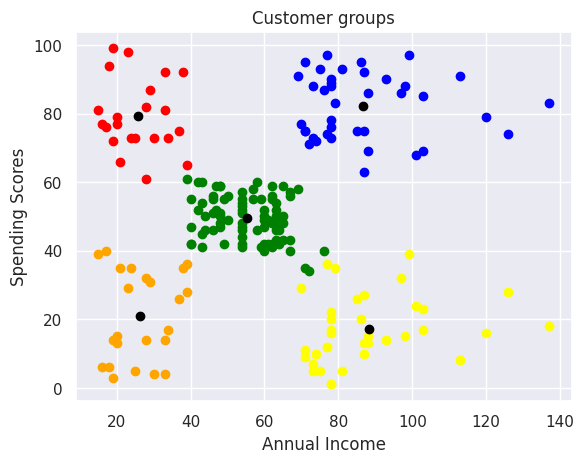

# Customer_Segmentation_Using_KMeans_Clustering

This project demonstrates the application of the KMeans clustering algorithm to segment customers based on their demographics and purchasing behavior.

# Dataset Overview
The dataset includes the following features:

CustomerID: Unique identifier for each customer.
Gender: Male or Female.
Age: Customer's age.
Annual Income (k$): Annual income in thousands of dollars.
Spending Score (1–100): Score assigned based on customer behavior and spending patterns.

# EDA 

# Model training

* Finding Optimal Number of Clusters (k)
* Used the Elbow Method to determine the optimal number of clusters
* Plotted Within-Cluster Sum of Squares (WCSS) for different values of k (1–10)
* Identified the "elbow point" where WCSS starts to diminish

# Results

